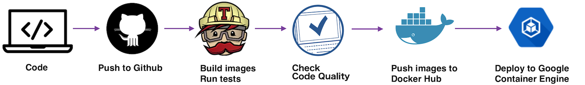

# Better Code Central

Code behind the Better Code Central website

This project is developed using a modern development pipeline:

Image at Docker Hub: https://hub.docker.com/r/robvanderleek/bettercodecentral/
